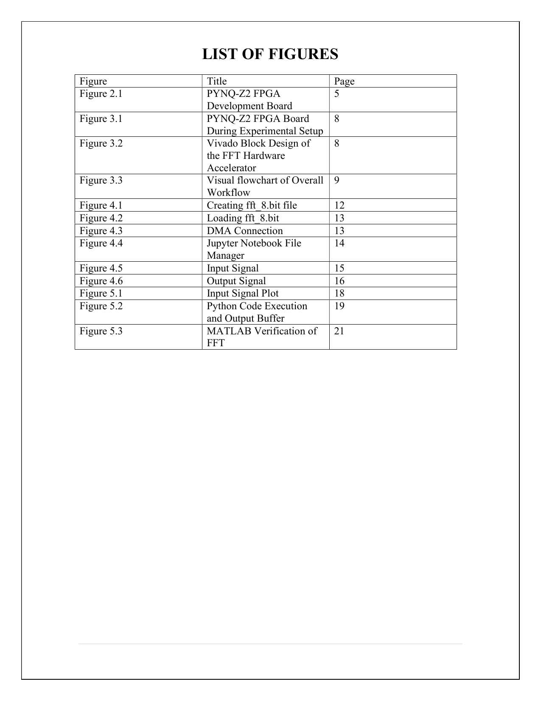
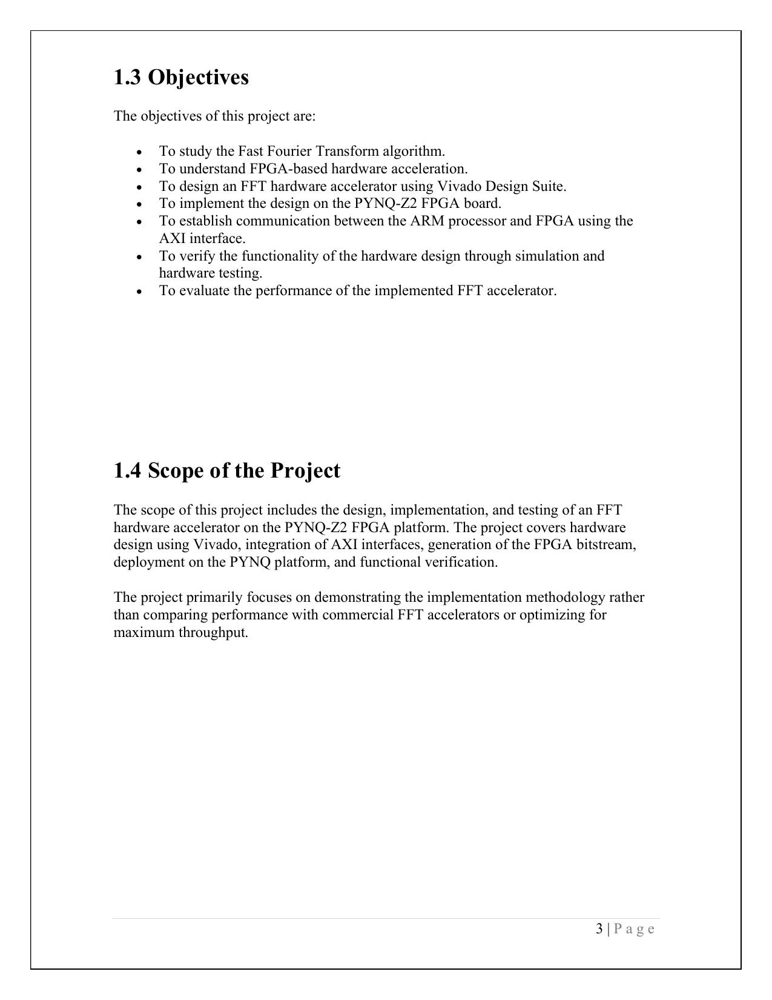
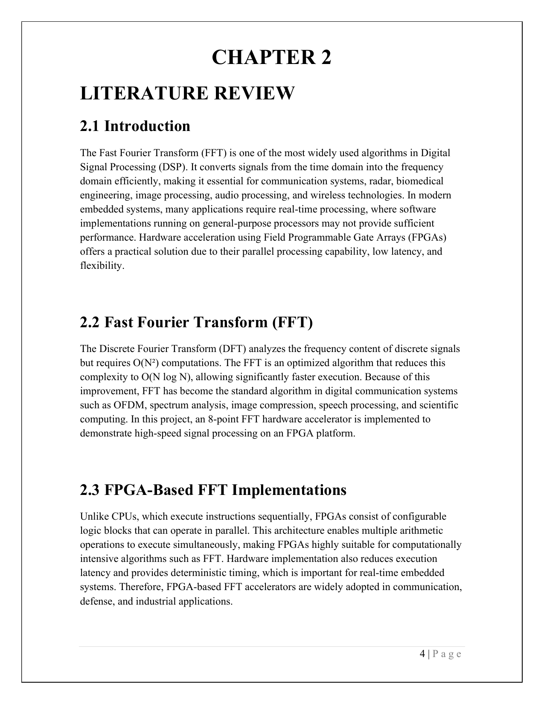
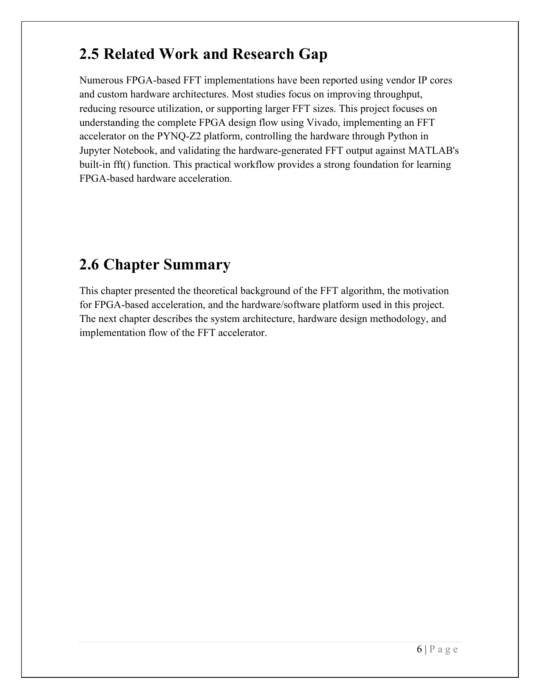
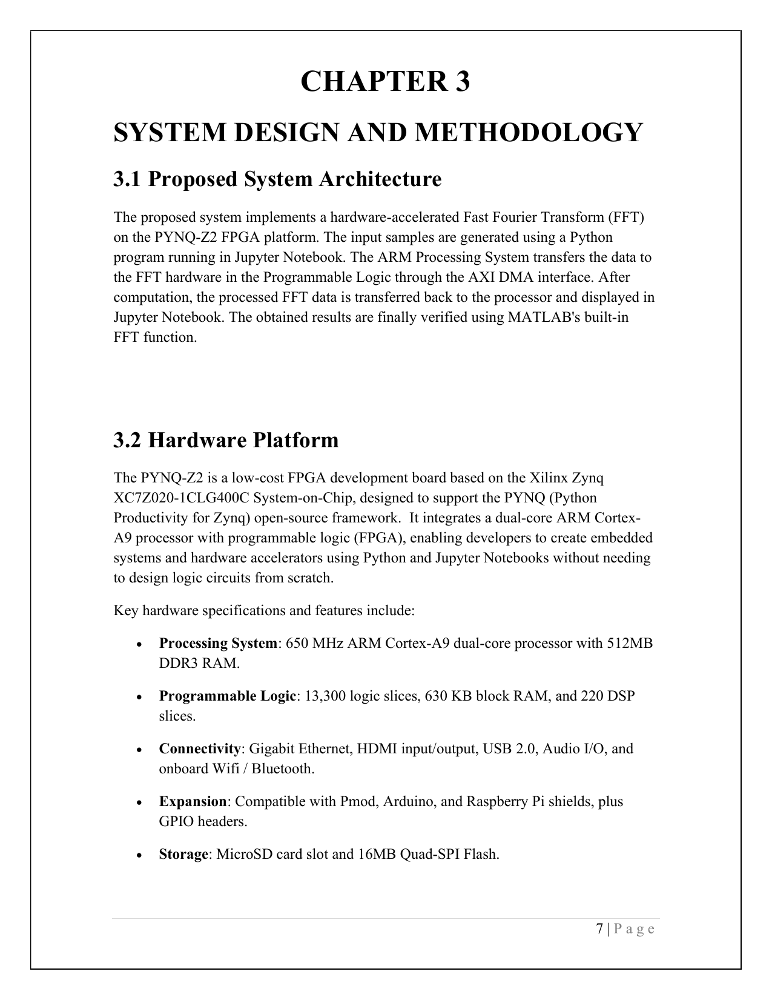
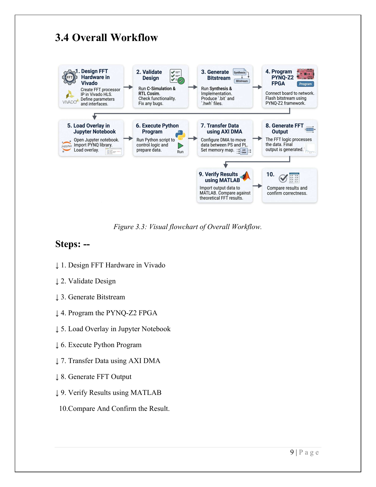
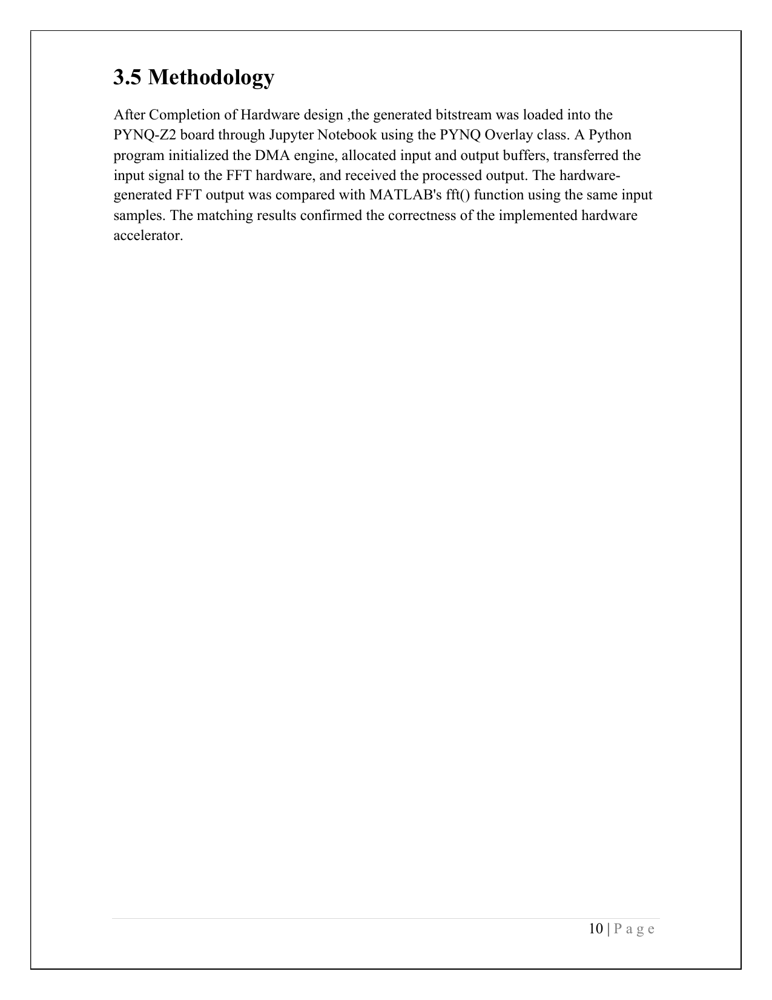
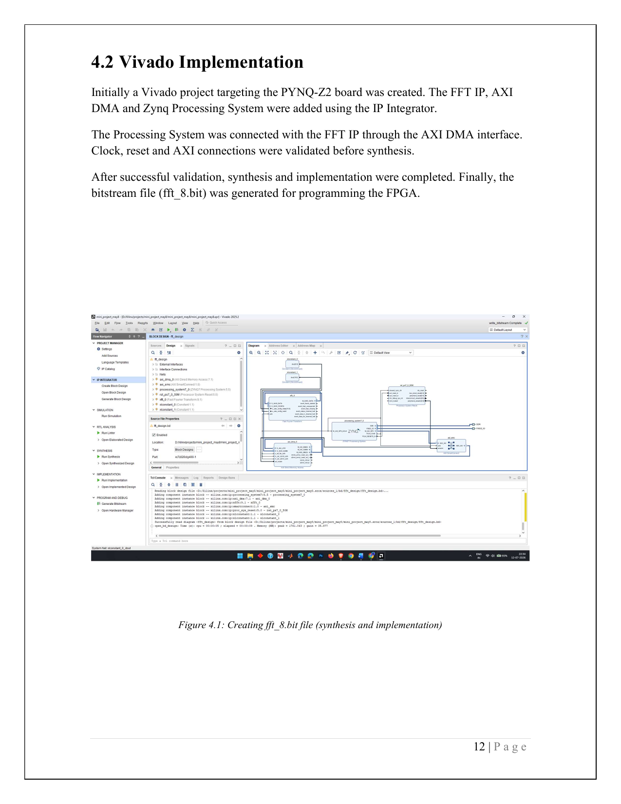
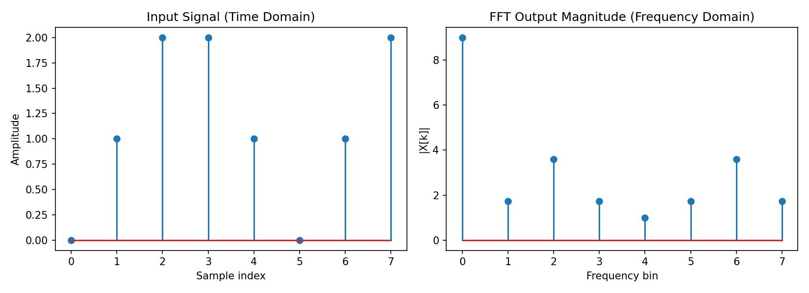

# High-Speed FFT Hardware Accelerator on PYNQ-Z2


An 8-point Fast Fourier Transform (FFT) hardware accelerator designed in **Xilinx Vivado**, deployed on the **PYNQ-Z2** (Zynq-7020 SoC) board, and driven from **Python/Jupyter Notebook** via the PYNQ Overlay framework. Results are cross-verified against MATLAB's built-in `fft()`.

> Final-year B.Tech project — Electronics and Communication Engineering, Kalyani Government Engineering College (MAKAUT, West Bengal).

---

## Table of Contents

- [Overview](#overview)
- [System Architecture](#system-architecture)
- [Hardware Platform](#hardware-platform)
- [Workflow](#workflow)
- [Implementation](#implementation)
- [Results](#results)
- [Performance Comparison](#performance-comparison)
- [Repository Structure](#repository-structure)
- [Getting Started](#getting-started)
- [Limitations & Future Work](#limitations--future-work)
- [Authors](#authors)
- [License](#license)

---

## Overview

The FFT is a cornerstone algorithm in digital signal processing, converting time-domain signals to the frequency domain far more efficiently than a direct Discrete Fourier Transform. Software FFTs on general-purpose CPUs are limited by sequential execution, which can be a bottleneck for real-time applications. This project offloads FFT computation to programmable hardware, exploiting the FPGA's parallelism for lower latency and deterministic timing.

**What this project does:**
- Implements an 8-point FFT accelerator using the Xilinx FFT IP core
- Integrates it with the Zynq Processing System via **AXI DMA**
- Controls the hardware entirely from **Python inside Jupyter Notebook** using the PYNQ Overlay framework
- Cross-checks the FPGA-generated output against **MATLAB's `fft()`**

---

## System Architecture

The hardware design was built in Vivado IP Integrator and includes the Zynq Processing System, the FFT IP core, an AXI DMA engine, an AXI Interconnect, and the associated clock/reset logic. The Processing System (software side) talks to the FFT hardware (programmable-logic side) exclusively through AXI DMA, which handles high-speed input/output transfer.



---

## Hardware Platform

The **PYNQ-Z2** board is built around a Xilinx **Zynq XC7Z020-1CLG400C** System-on-Chip, pairing a dual-core ARM Cortex-A9 processor with FPGA programmable logic — letting you prototype hardware accelerators and drive them with Python instead of hand-written RTL testbenches.


| Spec | Detail |
|---|---|
| Processing System | 650 MHz dual-core ARM Cortex-A9, 512 MB DDR3 RAM |
| Programmable Logic | 13,300 logic slices, 630 KB block RAM, 220 DSP slices |
| Connectivity | Gigabit Ethernet, HDMI I/O, USB 2.0, Audio I/O, onboard Wi-Fi/Bluetooth |
| Expansion | Pmod, Arduino, Raspberry Pi shields, GPIO headers |
| Storage | MicroSD slot, 16 MB Quad-SPI Flash |

---

## Workflow


1. Design the FFT hardware in Vivado (FFT IP core + AXI DMA + Zynq PS)
2. Validate the design (C-simulation / RTL co-simulation)
3. Run synthesis & implementation → generate the bitstream (`fft_8.bit`)
4. Program the PYNQ-Z2 FPGA
5. Load the overlay in Jupyter Notebook
6. Run the Python control script
7. Transfer data to/from the hardware over AXI DMA
8. Generate the FFT output on-chip
9. Verify the output against MATLAB's `fft()`
10. Compare and confirm correctness

---

## Implementation

### Vivado hardware build
The FFT IP, AXI DMA, and Zynq Processing System were wired together in the IP Integrator. Clock, reset, and AXI connections were validated before synthesis; the final bitstream (`fft_8.bit`) was generated for the board.



### PYNQ overlay + DMA access
```python
from pynq import Overlay
ol = Overlay("fft_8.bit")

data_channel = ol.fft_block.fft_dma
```
Loading the overlay configures the FPGA with the custom FFT design and exposes the AXI DMA engine to Python.



### Generating the input signal & allocating DMA buffers
```python
import numpy as np
from pynq import allocate

samples = 8
data = np.array([...], dtype=np.csingle)

input_buffer = allocate((8,), np.csingle)
output_buffer = allocate((8,), np.csingle)
```



### Running the FFT on hardware
```python
np.copyto(input_buffer, data)

send_channel = data_channel.sendchannel
recv_channel = data_channel.recvchannel

send_channel.transfer(input_buffer)
recv_channel.transfer(output_buffer)
send_channel.wait()
recv_channel.wait()
```
The full, ready-to-run version of this workflow is in [`src/fft_accelerator_demo.py`](src/fft_accelerator_demo.py).



---

## Results

### Simulation stage
The input signal was generated with NumPy, plotted with Matplotlib for a visual sanity check, then pushed through the overlay/DMA pipeline without runtime errors — confirming correct PS↔PL communication before hardware timing was evaluated.




### Hardware output
For the input sequence `[0, 1, 2, 2, 1, 0, 1, 2]`, the FPGA's first FFT bin (DC component) came out to **9 + 0j** — exactly the sum of the input samples, confirming correct FFT computation. The remaining bins held the complex frequency-domain coefficients.

### MATLAB verification
The same sequence was run through MATLAB's built-in `fft()`, and the coefficients matched the FPGA output closely, confirming the hardware implementation is functionally correct.



---

## Performance Comparison

| Parameter | FPGA Hardware FFT | Software FFT (MATLAB) |
|---|---|---|
| Execution method | Dedicated FPGA hardware | CPU-based software |
| Processing | Parallel | Sequential |
| Role | Validated implementation | Reference result |
| Flexibility | Requires new bitstream to change | Easy to modify |
| Best suited for | Real-time embedded systems | Analysis and simulation |

---
 ## Try It Without the Board Don't have the PYNQ-Z2 on hand? `src/fft_simulation_demo.py` runs the exact same 8-point input sequence from this report through a from-scratch radix-2 FFT and a mock PYNQ interface, entirely offline. Run it with: ``` python src/fft_simulation_demo.py ``` It reproduces the exact output from Figure 5.3 in the report, including the DC bin at 9 + 0j: 

 ---

## Repository Structure

```
.
├── README.md
├── LICENSE
├── requirements.txt
├── src/
│   └── fft_accelerator_demo.py   # Consolidated PYNQ control script
└── docs/
    └── images/                   # Figures extracted from the project report
```

---

## Getting Started

1. Build the FFT + AXI DMA + Zynq PS block design in Vivado, targeting the PYNQ-Z2, and generate `fft_8.bit`.
2. Copy `fft_8.bit` (and its `.hwh`) to the PYNQ-Z2 board.
3. Boot the board, open Jupyter Notebook over the network.
4. Copy `src/fft_accelerator_demo.py` into a notebook cell (or upload and run it) on the board.
5. Compare the printed hardware output against the NumPy/MATLAB reference.

```bash
pip install -r requirements.txt   # on the PYNQ-Z2's Python environment
```

---

## Limitations & Future Work

- Implemented at 8-point FFT size — a proof-of-concept scale, primarily for learning the full Vivado → PYNQ workflow.
- Resource utilization and timing closure were not optimization targets in this pass.
- Measured execution time in Jupyter includes Python/DMA-configuration overhead, not pure hardware compute time.
- **Next steps:** scale to 256-/1024-point FFTs, optimize resource usage, and integrate into a larger real-time DSP pipeline.

---

## Authors

- Dalim Mir
- Md Riajuddin
- Sk Sohel Inam
- Sougata Singha

Department of Electronics and Communication Engineering, Kalyani Government Engineering College, under the guidance of **Dr. Himadri Shekhar Dutta**.

## License

This project is licensed under the [MIT License](LICENSE).
